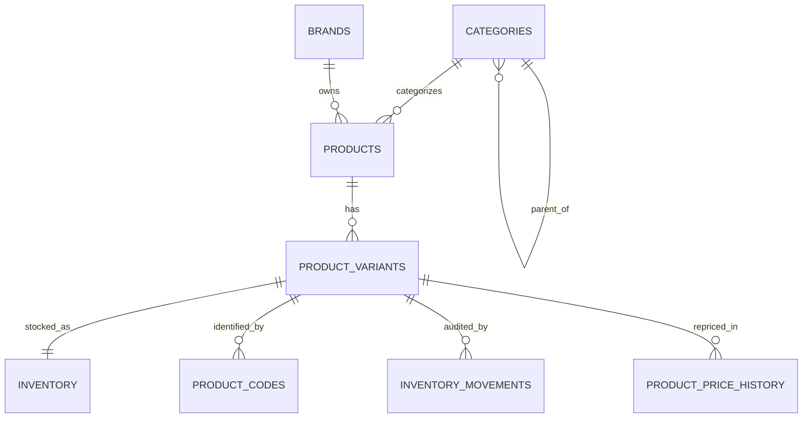

# PHASE 1 — DATABASE ARCHITECTURE (FROZEN)

> Scope: `categories, brands, products, product_variants, product_codes,`
> `inventory, inventory_movements, product_price_history` only.
> Out of scope: users, cart, orders, payments, delivery, replacements.
> Engine: **PostgreSQL 15+** (REVIEW-10: PKs are app-generated UUIDv7;
> column DEFAULT is `gen_random_uuid()` backstop only — builtin `uuidv7()` is PG 18+).
> Artifacts: `db/phase1-schema.sql` (DDL — source of truth),
> `db/phase1-seed-example.sql` (example dataset), `docs/phase1-erd.mmd` (ERD).

---

## A. Architecture Decisions

| # | Decision | Chosen Approach | Reason | Alternative Considered |
|---|----------|-----------------|--------|------------------------|
| 1 | Product code attachment | `product_codes.product_variant_id` (variant-level) | Barcode differs per size (330 ML ≠ 1 L); cashier scan must resolve to one priced unit | Product-level codes — rejected: ambiguous for multi-variant products |
| 2 | Weight product variants | **One** loose-weight variant per WEIGHT product (e.g. Romi = `KG` variant, price per KG); weight options derived in app from `sale_step_grams` | Prevents variant explosion (125g/250g/… are not SKUs); price & stock stay single-source | Variant-per-weight — rejected: N variants to reprice/restock per product |
| 3 | `sale_step_grams` placement | `products.sale_step_grams` (canonical) | Step is a product-level commercial rule (deli cutting granularity); one UPDATE changes 125→100/250/500 with zero DDL | Variant-level step — deferred: add `product_variants.sale_step_grams NULL`-override only if per-variant steps are ever really needed |
| 4 | Inventory granularity | One `inventory` row **per variant** (`UNIQUE(product_variant_id)`, 1:1) | 330 ML and 1 L have independent stock; weight KG stock independent of piece stock | Product-level stock — rejected: cannot represent per-size quantities |
| 5 | Quantity type | `NUMERIC(12,3)` for `quantity / reserved / movements` | Piece counts (500.000) and KG weights (47.350, 0.125, 0.475) in one column; gram precision (0.001 KG = 1 g); max 999,999.999 ≈ 1000 t | INTEGER — rejected: cannot store weights; FLOAT — rejected: rounding errors in stock |
| 6 | `available_quantity` | **GENERATED ALWAYS AS (`quantity - reserved_quantity`) STORED** | Consistency: impossible to drift; Performance: stored + indexable, no per-read math divergence; Concurrency: writers only touch `quantity`/`reserved_quantity` atomically | App-computed on read — rejected (divergent formulas, no filtering); independent stored column — rejected (drift risk) |
| 7 | Price history attachment | `product_price_history.product_variant_id` | Price lives on the variant; history must mirror the priced entity 1:1 | Product-level history — rejected: meaningless for multi-variant products |
| 8 | Code uniqueness | **Global `UNIQUE(code)`** | Scan/type happens without variant context; duplicates = ambiguous sale | Per-variant uniqueness — rejected: same barcode on two variants breaks POS |
| 9 | Slug uniqueness | **Unique per table** (`categories.slug`, `brands.slug`, `products.slug` each UNIQUE) | URL namespaces differ (`/c/…` vs `/p/…`); cross-table global uniqueness adds nothing | Global cross-table registry — rejected: overengineering |
| 10 | PK / UUID version | **UUIDv7 generated by the application**; DB DEFAULT `gen_random_uuid()` (pgcrypto) is backstop only | Time-ordered → B-tree locality without random-insert fragmentation; builtin `uuidv7()` is PG 18+ only, so it cannot be the DEFAULT on a PG 15+ target (fails at CREATE TABLE). Zero-migration switch to `uuidv7()` DEFAULT once fleet is PG 18+ | v4 — rejected (random I/O); BIGINT identity — rejected (sequence leak, painful merge); hand-rolled SQL v7 polyfill — rejected (untestable here, crypto bit-layout risk) |
| 16 | Product availability flag (REVIEW-02) | **REMOVED `products.is_available`; added `product_stock_status` VIEW** | A stored per-product boolean cannot represent mixed per-variant stock; every stock tx would need a second writer (drift class) and concurrent sales of sibling variants would serialize on one product row. VIEW = one live definition, zero sync | Keep + app sync rule — rejected (drift); keep + trigger sync — rejected (write amplification + contention for an unmeasured need) |
| 11 | Soft delete | **Both**: `is_active` (visibility switch) + `deleted_at` (tombstone); **never hard-delete** referenced rows | `is_active=false` = temporarily hidden, reversible; `deleted_at` = preserves history for future orders; CHECK keeps them consistent | Hard DELETE — rejected (destroys order history); `is_active` alone — rejected (cannot distinguish hidden vs deleted) |
| 12 | Movement reference | `reference_type VARCHAR NULL + reference_id VARCHAR(64) NULL`, **no FK in Phase 1** | Orders don't exist yet; VARCHAR id holds UUID strings today, supplier doc numbers tomorrow; FKs to `orders` added in Phase 2 | Per-type FK columns — rejected: overengineering before orders exist |
| 13 | Negative inventory | 3 layers: `CHECK(quantity>=0, reserved>=0, reserved<=quantity)` + atomic `UPDATE … WHERE quantity+delta>=0` (rowcount check) + `SELECT FOR UPDATE` transactions | DB CHECK is the last line of defense no app bug can bypass | App-only validation — rejected: raceable |
| 14 | Race conditions | Single atomic `UPDATE inventory SET quantity = quantity + $1 … RETURNING` inside a transaction holding `SELECT … FOR UPDATE`, movement row inserted in the **same** transaction | Serializes concurrent writers per variant row; log and state can never diverge | Read-modify-write in app — rejected: classic lost-update (100−2 and 100−3 → 97/98 wrong) |
| 15 | Price-change isolation | Phase 2 `order_items` **must** store `unit_price_snapshot` (+ pricing unit); `product_price_history` is audit-only; carts always re-price from live `product_variants.price` | Old orders frozen at 320 while live price moves to 350; no JOIN to live price from order history | Reading live price for old orders — rejected: rewrites financial history |

### Concurrency pattern (contract for Phase 2 code)

```sql
BEGIN;
SELECT quantity, reserved_quantity FROM inventory
 WHERE product_variant_id = $1 FOR UPDATE;
UPDATE inventory
   SET quantity = quantity + $2            -- $2 negative for SALE
 WHERE product_variant_id = $1
   AND quantity + $2 >= 0
   AND reserved_quantity <= quantity + $2
RETURNING quantity AS new_qty;
-- rowcount = 0  =>  insufficient stock, ROLLBACK
INSERT INTO inventory_movements
  (product_variant_id, movement_type, quantity,
   previous_quantity, new_quantity, reference_type, reference_id, reason, created_by)
VALUES ($1, 'SALE', $2, $old, $new, 'ORDER', $order_id, $reason, $admin);
COMMIT;
```

---

## B. Final Tables

Conventions: PK = `id UUID` (application sends UUIDv7; DB DEFAULT
`gen_random_uuid()` backstop only); money = `NUMERIC(10,2)`;
qty = `NUMERIC(12,3)`; time = `TIMESTAMPTZ DEFAULT now()`;
`created_by/changed_by UUID NULL` — FK to `users(id)` added in Phase 2.

### `categories`

| Field | Type | Nullable | Default | Constraints | Description |
|---|---|---|---|---|---|
| id | UUID | NO | UUIDv7 from app (backstop: gen_random_uuid()) | PK | — |
| name | VARCHAR(120) | NO | — | — | e.g. ألبان, جبن |
| slug | VARCHAR(140) | NO | — | UNIQUE; lowercase, no spaces | URL key, per-table unique |
| description | TEXT | YES | NULL | — | — |
| image | VARCHAR(500) | YES | NULL | — | image URL/path |
| parent_id | UUID | YES | NULL | FK→categories.id, RESTRICT/​CASCADE-update | NULL = root; cycle blocked by trigger |
| is_active | BOOLEAN | NO | TRUE | — | visibility switch |
| sort_order | INTEGER | NO | 0 | CHECK ≥ 0 | sibling ordering |
| created_at / updated_at | TIMESTAMPTZ | NO | now() | — | trigger keeps updated_at |
| deleted_at | TIMESTAMPTZ | YES | NULL | soft delete; CHECK: deleted ⇒ !is_active | never hard-delete |

### `brands`

| Field | Type | Nullable | Default | Constraints | Description |
|---|---|---|---|---|---|
| id | UUID | NO | UUIDv7 from app (backstop: gen_random_uuid()) | PK | — |
| name | VARCHAR(120) | NO | — | — | Pepsi, Juhayna… |
| slug | VARCHAR(140) | NO | — | UNIQUE; lowercase, no spaces | URL key |
| logo | VARCHAR(500) | YES | NULL | — | logo URL/path |
| is_active | BOOLEAN | NO | TRUE | — | visibility switch |
| created_at / updated_at | TIMESTAMPTZ | NO | now() | — | — |
| deleted_at | TIMESTAMPTZ | YES | NULL | soft delete; CHECK: deleted ⇒ !is_active | — |

### `products`

| Field | Type | Nullable | Default | Constraints | Description |
|---|---|---|---|---|---|
| id | UUID | NO | UUIDv7 from app (backstop: gen_random_uuid()) | PK | — |
| name | VARCHAR(160) | NO | — | — | e.g. جبنة رومي |
| slug | VARCHAR(180) | NO | — | UNIQUE; lowercase, no spaces | URL key |
| description | TEXT | YES | NULL | — | — |
| category_id | UUID | NO | — | FK→categories.id, **RESTRICT** | every product categorized |
| brand_id | UUID | YES | NULL | FK→brands.id, **RESTRICT** | NULL = unbranded/loose |
| product_type | VARCHAR(10) | NO | — | CHECK IN (PIECE, WEIGHT) | VARCHAR+CHECK (extensible, no ENUM migration) |
| unit | VARCHAR(10) | NO | — | CHECK IN (PIECE,KG,GRAM,LITER,ML) | base sale unit |
| sale_step_grams | INTEGER | YES | NULL | WEIGHT: NOT NULL & >0; PIECE: must be NULL (CHECK) | e.g. 125; change anytime, no DDL |
| is_active | BOOLEAN | NO | TRUE | — | admin listing switch; sole visibility flag (availability is derived, §B-view) |
| created_at / updated_at | TIMESTAMPTZ | NO | now() | — | — |
| deleted_at | TIMESTAMPTZ | YES | NULL | soft delete; CHECK: deleted ⇒ !is_active | — |

### `product_variants` — price lives here, nowhere else

| Field | Type | Nullable | Default | Constraints | Description |
|---|---|---|---|---|---|
| id | UUID | NO | UUIDv7 from app (backstop: gen_random_uuid()) | PK | — |
| product_id | UUID | NO | — | FK→products.id, RESTRICT | variant always belongs to a product |
| name | VARCHAR(120) | NO | — | UNIQUE(product_id, name) | e.g. `330 ML`, `KG` |
| size_value | NUMERIC(10,3) | YES | NULL | CHECK > 0 | price-basis magnitude: 1 (= per 1 KG), 330, 2.5 — NOT requested/actual weight |
| size_unit | VARCHAR(10) | YES | NULL | CHECK IN (PIECE,KG,GRAM,LITER,ML) | price-basis unit (per KG / per ML…) — NOT customer weight |
| price | NUMERIC(10,2) | NO | — | CHECK ≥ 0 | **current selling price, source of truth** |
| compare_at_price | NUMERIC(10,2) | YES | NULL | CHECK ≥ price | was-price anchor (must be ≥ price) |
| cost_price | NUMERIC(10,2) | YES | NULL | CHECK ≥ 0 | purchasing cost |
| is_active | BOOLEAN | NO | TRUE | — | sellable switch |
| created_at / updated_at | TIMESTAMPTZ | NO | now() | — | — |
| deleted_at | TIMESTAMPTZ | YES | NULL | soft delete | — |

### `product_codes` — `code` is VARCHAR (keeps leading zeros)

| Field | Type | Nullable | Default | Constraints | Description |
|---|---|---|---|---|---|
| id | UUID | NO | UUIDv7 from app (backstop: gen_random_uuid()) | PK | — |
| product_variant_id | UUID | NO | — | FK→variants.id, **CASCADE** (only CASCADE in schema) | codes have no independent history |
| code | VARCHAR(64) | NO | — | **UNIQUE globally**; non-empty, no spaces | `2010106`, `02010106`, EAN-13… |
| type | VARCHAR(20) | NO | — | CHECK IN (BARCODE, INTERNAL_CODE) | extensible set |
| is_primary | BOOLEAN | NO | FALSE | partial UQ: one primary per variant | POS default |
| created_at / updated_at | TIMESTAMPTZ | NO | now() | — | — |

### `inventory` — one row per variant (1:1), current state (not history)

| Field | Type | Nullable | Default | Constraints | Description |
|---|---|---|---|---|---|
| id | UUID | NO | UUIDv7 from app (backstop: gen_random_uuid()) | PK | — |
| product_variant_id | UUID | NO | — | FK→variants.id, RESTRICT; **UNIQUE** (1:1) | created with the variant in one tx |
| quantity | NUMERIC(12,3) | NO | 0 | CHECK ≥ 0 | on hand (pcs or KG) |
| reserved_quantity | NUMERIC(12,3) | NO | 0 | CHECK ≥ 0, CHECK ≤ quantity | held for open orders (used in Phase 2) |
| available_quantity | NUMERIC(12,3) | NO | — | **GENERATED ALWAYS AS (quantity − reserved_quantity) STORED** | never written by app |
| low_stock_threshold | NUMERIC(12,3) | YES | NULL | CHECK ≥ 0 | alert level, same unit |
| updated_at | TIMESTAMPTZ | NO | now() | trigger-maintained | (no created_at: state row, not event) |

### `inventory_movements` — append-only audit log (immutable)

| Field | Type | Nullable | Default | Constraints | Description |
|---|---|---|---|---|---|
| id | UUID | NO | UUIDv7 from app (backstop: gen_random_uuid()) | PK | — |
| product_variant_id | UUID | NO | — | FK→variants.id, RESTRICT | — |
| movement_type | VARCHAR(20) | NO | — | CHECK IN (STOCK_IN, SALE, RETURN, WASTE, ADJUSTMENT, REPLACEMENT, CANCELLED_ORDER) | — |
| quantity | NUMERIC(12,3) | NO | — | CHECK ≠ 0 (signed delta) | −2 sale, +100 intake |
| previous_quantity | NUMERIC(12,3) | NO | — | CHECK ≥ 0 | e.g. 100 |
| new_quantity | NUMERIC(12,3) | NO | — | CHECK ≥ 0; **CHECK = previous + quantity** | e.g. 98 |
| reference_type | VARCHAR(20) | YES | NULL | CHECK IN (ORDER, PURCHASE, RETURN, ADJUSTMENT, MANUAL) | Phase 2 adds FK for ORDER |
| reference_id | VARCHAR(64) | YES | NULL | CHECK: id ⇒ type present | UUID string or external doc no. |
| reason | TEXT | YES | NULL | — | human explanation |
| created_by | UUID | YES | NULL | FK→users(id) in Phase 2 | who changed it |
| created_at | TIMESTAMPTZ | NO | now() | — | (no updated_at/deleted_at: immutable; app role gets INSERT+SELECT only) |

### `product_price_history` — append-only (immutable)

| Field | Type | Nullable | Default | Constraints | Description |
|---|---|---|---|---|---|
| id | UUID | NO | UUIDv7 from app (backstop: gen_random_uuid()) | PK | — |
| product_variant_id | UUID | NO | — | FK→variants.id, RESTRICT | mirrors the priced entity |
| old_price | NUMERIC(10,2) | NO | — | CHECK ≥ 0 | e.g. 320 |
| new_price | NUMERIC(10,2) | NO | — | CHECK ≥ 0; CHECK ≠ old_price | e.g. 340 |
| changed_by | UUID | YES | NULL | FK→users(id) in Phase 2 | who changed it |
| reason | TEXT | YES | NULL | — | e.g. supplier increase |
| created_at | TIMESTAMPTZ | NO | now() | — | (no updated_at/deleted_at: immutable) |

### `product_stock_status` — VIEW, not a table (REVIEW-02)

| Field | Type | Nullable | Definition |
|---|---|---|---|
| product_id | UUID | NO | `products.id` |
| sellable_variants | BIGINT | NO | count of active, non-deleted variants |
| in_stock_variants | BIGINT | NO | …with `available_quantity > 0` |
| is_in_stock | BOOLEAN | NO | TRUE iff ≥1 sellable variant has stock |

Rules: derived live on every read (zero sync, zero drift); variant-level truth stays in
`inventory.available_quantity`; **no summed quantity** — variants of one product may mix
units (ML vs LITER), so totals would be unit-incoherent. Reintroduce a stored flag only
on measured read pressure, as a trigger-maintained cache — never as a second writer owned by app code.

---

## C. Relationships

| Relationship | Cardinality | FK | Delete behavior | Notes |
|---|---|---|---|---|
| categories → categories (parent) | 1 : N, self-ref | `categories.parent_id` NULL | **RESTRICT** | NULL = root; self-parent and cycles rejected (trigger `prevent_category_cycle`) |
| categories → products | 1 : N | `products.category_id` NOT NULL | **RESTRICT** | cannot delete a category that still has products; move them first |
| brands → products | 1 : N | `products.brand_id` NULL | **RESTRICT** | NULL = unbranded/loose (e.g. Romi); cannot delete a brand in use |
| products → variants | 1 : N | `product_variants.product_id` | **RESTRICT** | no size-less product sold; variants soft-deleted, never cascade-wiped |
| variants → codes | 1 : N | `product_codes.product_variant_id` | **CASCADE** | only CASCADE in schema: codes are meaningless without their variant |
| variants → inventory | 1 : 1 | `inventory.product_variant_id` UNIQUE | **RESTRICT** | row created with variant; stock is per sellable size |
| variants → movements | 1 : N | `inventory_movements.product_variant_id` | **RESTRICT** | append-only log, never deleted |
| variants → price history | 1 : N | `product_price_history.product_variant_id` | **RESTRICT** | append-only log, never deleted |
| (Phase 2) users → audit cols | 1 : N | `movements.created_by`, `price_history.changed_by` | — | placeholders, no FK until users exist |

All FKs use `ON UPDATE CASCADE` (UUIDs never change in practice; harmless safety).

---

## D. ERD

Full diagram: `docs/phase1-erd.mmd` (Mermaid, renders on GitHub / mermaid.live).



---

## E. Index Strategy

| Table | Index | Columns | Reason |
|---|---|---|---|
| categories | UQ (constraint) | slug | URL lookup + uniqueness |
| categories | idx_categories_parent_id | parent_id | children listing, subtree queries |
| categories | idx_categories_storefront (partial) | (parent_id, sort_order) WHERE active & !deleted | hot storefront menu query, skips hidden rows |
| brands | UQ (constraint) | slug | URL lookup + uniqueness |
| products | UQ (constraint) | slug | URL lookup + uniqueness |
| products | idx_products_category_id | category_id | category listing (most common filter) |
| products | idx_products_brand_id | brand_id | brand pages, brand-admin queries |
| products | idx_products_type | product_type | PIECE/WEIGHT filtered flows (deli vs shelf) |
| products | idx_products_storefront (partial) | (category_id, is_active) WHERE deleted_at IS NULL | storefront listing without touching dead rows |
| product_variants | UQ (constraint) | (product_id, name) | duplicate-size protection |
| product_variants | idx_variants_product_id | product_id | PDP variant fetch |
| product_variants | idx_variants_sellable (partial) | (product_id) WHERE active & !deleted | sellable-options query |
| product_codes | UQ (constraint) | code | POS scan resolution (exact match) + global uniqueness |
| product_codes | idx_codes_variant_id | product_variant_id | variant → codes fetch |
| product_codes | uq_codes_one_primary (partial UQ) | (product_variant_id) WHERE is_primary | enforces single primary code |
| inventory | UQ (constraint, 1:1) | product_variant_id | doubles as the lookup index; no extra index needed |
| inventory_movements | idx_movements_variant_time | (product_variant_id, created_at DESC) | stock ledger per variant (latest-first) |
| inventory_movements | idx_movements_type | movement_type | waste/sale analytics |
| inventory_movements | idx_movements_reference | (reference_type, reference_id) | "show me everything order X touched" |
| product_price_history | idx_price_history_variant_time | (product_variant_id, created_at DESC) | price timeline per variant |

Deliberately **no** index on:
`description/reason/image` (never filter/sort keys), `created_by` (added with Phase 2 FK if needed).
(REVIEW-12: standalone `(sort_order)` index removed — sibling ordering rides on the storefront partial index.)

---

## F. Constraints

- **PK**: `id UUID` on all 8 tables (app-generated UUIDv7; `gen_random_uuid()` backstop).
- **FK**: §C table above. Rule of thumb: **RESTRICT everywhere except `product_codes → CASCADE`**.
  Rationale: deleting a category/brand/product/variant that has live references must fail loudly
  (admin reassigns first); only codes are safe to cascade (no independent history).
- **Unique**: `categories.slug`, `brands.slug`, `products.slug` (each per-table);
  `product_variants(product_id, name)`; `product_codes.code` (global);
  `inventory.product_variant_id` (1:1); partial UQ one-primary-code per variant.
- **Check**: type whitelists (`product_type`, `unit/size_unit`, `code.type`, `movement_type`,
  `reference_type`); `products` weight rule (WEIGHT⇒metric unit + step>0; PIECE⇒step IS NULL);
  money ≥ 0; `compare_at_price ≥ price`; qty ≥ 0, `reserved ≤ quantity`; movement
  `quantity ≠ 0`, `new = previous + quantity`, `reference_id ⇒ reference_type`;
  `price_history: old ≠ new`; slug format (lowercase, no spaces, non-empty);
  `sort_order ≥ 0`; soft-delete consistency (`deleted ⇒ !is_active` on all four soft-deleted tables);
  `size_value > 0`; code non-empty.
- **Not Null**: §B; notably `products.category_id`, `variants.price`, movement qty/prev/new.
- **Delete behavior**: RESTRICT (7 FKs) / CASCADE (codes only) / soft-delete via `deleted_at`.
- **Extra DB enforcement**: `prevent_category_cycle()` trigger (recursive CTE, blocks circular
  hierarchies — something CHECK cannot express); `set_updated_at()` triggers; generated
  `available_quantity`; append-only convention (no UPDATE/DELETE grants on the two log tables).

---

## G. Data Integrity Rules

1. **Weight products use metric units**: `product_type=WEIGHT` ⇒ `unit ∈ {KG, GRAM}` AND `sale_step_grams > 0` (DB CHECK). A WEIGHT product in PIECE/LITER is rejected at insert.
2. **PIECE products carry no sale step**: `product_type=PIECE` ⇒ `unit=PIECE` AND `sale_step_grams IS NULL` (DB CHECK). Prevents silent misconfiguration of deli logic on shelf goods.
3. **Codes unique globally**: `UNIQUE(code)` + VARCHAR type (keeps `02010106` intact). Any duplicate scan-target fails at the DB, not at checkout.
4. **Variant belongs to exactly one product**: `product_id NOT NULL + RESTRICT`. No orphan/ floating variants.
5. **Inventory bound to variant 1:1**: `UNIQUE(product_variant_id)`; the row is created in the same transaction as the variant. No product-level stock totals stored (they're always derivable).
6. **Price history bound to variant**: mirrors the priced entity; `old ≠ new` enforced.
7. **No movement without a log row**: convention + review rule — every `inventory` UPDATE inserts its `inventory_movements` row in the same transaction, with `new = previous + quantity` verified by CHECK.
8. **Money = DECIMAL, never FLOAT**: `NUMERIC(10,2)` (max ≈ 100 M EGP, piastre-exact). Weights = `NUMERIC(12,3)` (gram-exact). No binary floating point anywhere near money or stock.
9. **Requested vs actual weight stays out of catalog**: both are order-time facts → Phase 2 `order_items.requested_qty / actual_qty`. Catalog only exposes `sale_step_grams` (to *offer* options) and price-per-unit (to *price* them).
10. **Slugs are per-table unique, lowercase, spaceless, immutable after creation** (rotation later = redirect table, Phase 2+ if ever).
11. **Logs are immutable**: no `updated_at`/`deleted_at` on `inventory_movements` / `product_price_history`; app role granted INSERT+SELECT only.
12. **Soft-delete, don't destroy**: anything that can appear in a future order is retired via `is_active=false` + `deleted_at`, never `DELETE`.
13. **Availability is derived, never stored** (REVIEW-02): `product_stock_status` VIEW is the single
    definition of product in-stock; per-variant truth is `inventory.available_quantity`. No sync job, no trigger, nothing to drift.

---

## H. Example Data

Full runnable seed: `db/phase1-seed-example.sql`. Summary:

**Category** `dairy-cheese` — «ألبان وجبن» (root, `sort_order=1`).

**Product — جبنة رومي** (`romi-cheese`, WEIGHT/KG, `sale_step_grams=125`, unbranded):
- Variant `KG` (`size 1 KG`): **price 320.00** /KG (cost 280.00)
- Code: `2010106` (INTERNAL_CODE, primary)
- Inventory: `quantity 47.350`, `reserved 0.000` → `available 45.225` KG; threshold 5.000
- Movement: `STOCK_IN +47.350` (0 → 47.350, ref `PURCHASE/PO-2026-0001`)
- Price history: `300.00 → 320.00`
- App-derived options from step 125: 125g (40.00) · 250g (80.00) · 375g (120.00) · **500g (160.00)** · … · 1kg (320.00). A 475g actual weigh-out prices as `320×0.475 = 152.00` — no schema change needed.

**Product — Pepsi** (`pepsi`, PIECE/PIECE, brand Pepsi):

| Variant | size | price | code (BARCODE, primary) | stock |
|---|---|---|---|---|
| 330 ML | 330 ML | 15.00 | 6221001000331 | 500 pcs |
| 1 L | 1 LITER | 30.00 | 6221001001000 | 300 pcs |
| 2.5 L | 2.5 LITER | 55.00 | 6221001002500 | 150 pcs |

Each variant has its own `STOCK_IN` movement (0 → N) and independent `inventory` row.

---

## Self-review (§26)

- [x] Products · [x] Variants · [x] Codes (VARCHAR, global UQ) · [x] Weight products (step rule, 1 variant)
- [x] Categories (self-ref, RESTRICT, anti-cycle trigger) · [x] Brands (slug UQ)
- [x] Inventory (per-variant 1:1, generated available) · [x] Movements (append-only, self-checking math)
- [x] Price history (variant-level, immutable) · [x] UUIDv7 · [x] Money NUMERIC(10,2) · [x] Weight NUMERIC(12,3)
- [x] FKs + RESTRICT-except-codes · [x] Unique constraints · [x] Indexes (with reasons, partials)
- [x] Auditability (`created_by/changed_by` placeholders + immutable logs)
- [x] Concurrency (atomic UPDATE + FOR UPDATE + same-tx log pattern)
- [x] Soft delete (is_active + deleted_at + consistency CHECKs) · [x] Slugs (per-table UQ + format CHECK)
- [x] Future-orders compatible (snapshots rule, requested/actual placement, reference placeholders)

**Status: FROZEN — awaiting approval before any Phase 2 object (users/cart/orders/…) is created.**

---

## FINAL REVIEW (pre-approval audit — no live PG on this machine, static review only)

Point-by-point (review items 1–13):

1. `sale_step_grams` on Product — **APPROVED, kept**. With exactly one loose-weight variant per WEIGHT
   product the step is functionally dependent on the product; one UPDATE changes 125→100/250/500.
   INTEGER grams is correct for deli-scale retail (fractional-gram steps explicitly out of scope).
   Decision + limitation now also pinned as a column COMMENT in the DDL.
2. `products.is_available` — **FIXED: column REMOVED**, replaced by `product_stock_status` VIEW.
   Three compounding defects: (a) no sync mechanism existed in the frozen schema — drift guaranteed
   the moment Phase 2 writes stock; (b) a stored copy forces every stock tx to lock the parent
   product row, serializing concurrent sales of sibling variants; (c) one boolean cannot express
   mixed per-variant stock (Pepsi 330ML out + 1L in). The VIEW has one live definition, zero sync.
3. `size_value/size_unit` — **APPROVED, clarified**. They are the variant's *price basis*
   (1 per KG; 330 per ML), structurally incapable of colliding with requested/actual weight because
   those columns do not exist anywhere in Phase 1 (they belong to Phase 2 `order_items`).
   Semantics now pinned as column COMMENTs + §B descriptions.
4. `NUMERIC(12,3)` — **APPROVED**. 47.350 / 0.125 / 500.000 all exact; ceiling 999,999.999 ≈
   1000 t per variant (absurd headroom for on-hand); CHECK arithmetic (`new = previous + quantity`)
   is exact in NUMERIC — no float error possible.
5. `product_codes.code` — **APPROVED**. VARCHAR(64) preserves `02010106`; global UNIQUE resolves every
   scan to one variant; single-primary enforced by partial UQ. Convention noted: codes are
   case-sensitive — store as-printed (LOW residual, numeric EANs unaffected).
6. `available_quantity` GENERATED STORED — **APPROVED, provably safe**. Legal since PG 12;
   `available < 0` and `reserved > quantity` are *structurally impossible* given
   `quantity ≥ 0 ∧ reserved ≥ 0 ∧ reserved ≤ quantity`; MVCC-consistent for readers; writers touch
   only the two base columns. Seed correctly omits the column.
7. Movement consistency — **APPROVED + hardened**. `chk_movements_math` guarantees every log row is
   self-consistent; same-transaction pairing is now pinned as COMMENTs on both tables (the DB cannot
   express "exactly one log row per UPDATE" without fragile machinery — stated honestly, not hidden).
   Residual: `previous_quantity` factuality depends on callers using the frozen
   `SELECT FOR UPDATE … RETURNING` pattern. Mitigation: reconciliation query (below) + review gate.
8. Soft delete — **APPROVED**. `deleted ⇒ !is_active` CHECKs on all four soft-deleted tables
   (products limb simplified after FIX-2); both log tables have no `deleted_at` + RESTRICT FKs —
   history is unreachable by deletion. Immutability grants remain an ops task (no roles exist yet).
9. Cycle prevention — **APPROVED with documented limits**. Trigger blocks self-parent + ancestor
   cycles via recursive CTE. Two honest limits: depth cap 50 (deliberate fail-safe — an unbounded
   walk would hang, not fail, if a cycle were ever planted by a superuser bypass; real depth is 2–4),
   and a concurrent two-transaction opposite-link race (accepted LOW: category edits are rare,
   single-admin operations).
10. UUIDv7 on PG 15+ — **FIXED**. `DEFAULT uuidv7()` would fail at CREATE TABLE on PG 15–17
    (builtin is PG 18+). Now: app generates UUIDv7 for every id (frozen contract), DB DEFAULT is
    `gen_random_uuid()` backstop via pgcrypto. Hand-rolled SQL v7 polyfill rejected (unverifiable
    without a live server here). Zero-migration path to `uuidv7()` DEFAULT on PG 18+.
11. FKs / delete behaviors — **APPROVED, all 7 re-verified**: RESTRICT everywhere except
    `product_codes → CASCADE` (codes have no independent history). `category_id NOT NULL` is
    consistent with RESTRICT (reassign-before-delete); nullable `brand_id` correctly models loose goods.
12. Indexes — **FIXED (one removal)**. `idx_categories_sort_order` dropped (redundant with the
    storefront partial index; no real global-sort query). All 15 remaining indexes/uniques mapped to
    a concrete query or enforcement each; inventory needs none beyond its 1:1 UQ.
13. Price history — **APPROVED**. Variant-keyed, append-only, `old ≠ new`; nothing in Phase 1 reads it
    for pricing; Phase 2 snapshot contract (`unit_price_snapshot` + pricing unit) pinned in DDL COMMENT
    and §A15. Carts re-price from live variant price by documented rule.

Reconciliation query (periodic audit / Phase 2 health check):

```sql
-- Every variant's live quantity must equal its latest movement's new_quantity.
SELECT i.product_variant_id, i.quantity AS live_qty, m.new_quantity AS last_logged_qty
FROM inventory i
JOIN LATERAL (SELECT new_quantity FROM inventory_movements
               WHERE product_variant_id = i.product_variant_id
               ORDER BY created_at DESC LIMIT 1) m ON true
WHERE i.quantity <> m.new_quantity;
-- Expected: zero rows, always.
```

### Risk assessment (database engineering risk only)

| Level | Items |
|---|---|
| CRITICAL | — none — |
| HIGH | — none remaining — (both HIGH findings fixed in this pass: PG15-incompatible UUID default; drifting `is_available`) |
| MEDIUM | M1: `movements.previous_quantity` factuality relies on future code following the frozen `SELECT FOR UPDATE … RETURNING` pattern (DB cannot cross-check it) → mitigated by COMMENTs + reconciliation query + review gate |
| LOW | L1: category-link race / 50-depth cap (rare admin op, documented) · L2: code case-sensitivity convention · L3: INTEGER-gram steps exclude sub-gram deli steps (accepted) · L4: log-table immutability is grants-by-convention until roles exist |
| NONE | sale_step placement · NUMERIC(12,3) · global code uniqueness · generated `available_quantity` · FK/delete matrix · soft-delete CHECKs · price-history isolation · index set (post-fix) |

### Freeze confirmation

**PHASE 1 DATABASE ARCHITECTURE APPROVED FOR FREEZE** — 8 tables + 1 derived view,
no Phase 2 objects created, no Phase 2 work started. Awaiting explicit approval to proceed.
