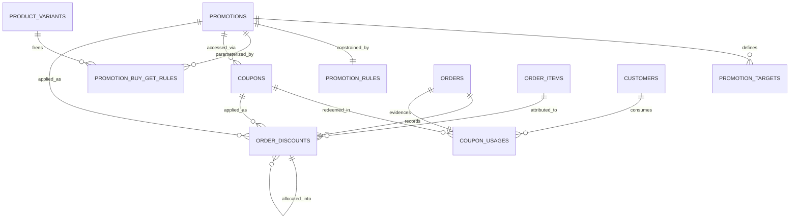

# PHASE 4 — PROMOTIONS + COUPONS ARCHITECTURE (PROPOSAL, design only)

> Status: PROPOSAL. No SQL, no code, no implementation.
> Phase 1 + Phase 2 FROZEN and untouched — zero modifications proposed (conflict check §24: none).
> Conventions inherited: UUID PKs (app v7), `NUMERIC(10,2)` money, `NUMERIC(12,3)` quantities,
> soft-delete pattern, append-only histories, RESTRICT-by-default, READ COMMITTED + row locks.

## §0. CURRENT SCHEMA COMPATIBILITY REPORT (read: phase1/2 schemas, proposal, ERDs, impl notes)

**Reusable as-is.** Phase 1: `products(id, product_type, unit, sale_step_grams, is_active, deleted_at)`,
`product_variants(id, product_id, size_value, size_unit, price, is_active, deleted_at)`,
`categories(id, parent_id)`, `brands(id)`, `inventory` + `product_stock_status` VIEW,
`product_price_history` (base-price audit — base price never moves for promos, §1).
Phase 2: `customers(id, phone)` identity for per-customer limits; `carts` + `cart_items`
(`quantity`, counting-unit `unit_snapshot`, `unit_price_snapshot`, `price_checked_at`);
`orders` (`order_number`, `idempotency_key`, `status`, `subtotal_estimated/discount_total/delivery_fee/total_estimated`
with balancing CHECKs, `subtotal_final/total_final`); `order_items` (`unit_price` frozen,
`requested/actual_quantity`, `estimated/final_total` with ROUND CHECKs, `discount_amount`,
`item_status`); `order_status_history`; `order_item_replacements`.

**What promotions attach to:** variant/product/category/brand ids (read-only matching),
`orders.discount_total` (the designated commercial-discount bucket — promo/coupon sums flow here,
balancing CHECKs hold unchanged), `order_items.discount_amount` (item-level share mirror),
checkout tx (insertion point), order lifecycle (finalize recompute).

**Must not touch:** all frozen tables/columns/CHECKs/triggers, inventory semantics, checkout boundaries,
weighted semantics, customer identity.

**Conflicts: ONE — RESOLVED by amended interpretation below (frozen schema untouched).**
Evidence: (a) `orders` total CHECKs are arithmetic over
`discount_total` regardless of discount source — promo sums fit without schema change;
(b) item ROUND CHECKs force gross math, so promo discounts live in `discount_amount`/`order_discounts`,
never in `unit_price` — by construction; (c) AMENDED: `discount_total` is the
**checkout-agreed estimate snapshot** required by frozen `chk_orders_total_estimated`
(`total_estimated = subtotal_estimated − discount_total + delivery_fee`) and is NEVER
rewritten at finalize — Phase 2 "frozen" governs its meaning, and the estimate equation
binds it permanently; (d) inventory reserve quantities are promo-blind (boundary §30).

### Conflict resolution R19-amended (approved): two discount meanings

Why it existed: R19 originally directed `discount_total` to track final-basis promo sums at
finalize; frozen `chk_orders_total_estimated` binds `discount_total` to the estimate equation,
so any finalize rewrite breaks it (proven: 160 − 15.20 + 0 = 144.80 ≠ 144.00).
Why Phase 2 stays frozen: the CHECK is the authoritative order-total contract; weakening it
was explicitly rejected. Why `discount_total` remains checkout-agreed: it is the number the
frozen contract balances against `total_estimated`.
Where final actual discount lives: `order_discounts.discount_final` (per application/allocation
row) + `order_items.discount_amount` mirror + `coupon_usages.final_discount_amount`
+ `orders.subtotal_final`/`total_final` (the latter computed with frozen estimate discount:
`total_final = subtotal_final − LEAST(discount_total, subtotal_final) + delivery_fee`).
Weighted finalize behavior: recompute row finals from row snapshots × actual qty only;
update mirrors, usages finals, `subtotal_final`, `total_final`; never touch `discount_total`.
Reconciliation: compare estimate rows vs final rows per application (`16.00 − 15.20 = 0.80`
must equal `(requested − actual) × unit_price × percent`); assert
`SUM(order_items.discount_amount) = SUM(order_discounts.discount_final)` over line-attributed
rows. Never claim `orders.discount_total` equals final allocation when actuals moved.

## A. Decisions (binding)

| # | Decision | Approach | Why (rejected) |
|---|---|---|---|
| 1 | Base≠promo price | `product_variants.price` never moves; promos are separate rules; line math stays gross | Mutating base price rejected (destroys price history + live orders) |
| 2 | Targets | `promotion_targets(promotion_id, target_type, target_id)`; types VARIANT, PRODUCT, BRAND, CATEGORY; NO real FK (polymorphic trade-off documented: existence validated at activation + orphan reconciliation; mirrors existing `actor_id` pattern) | 3 nullable FK columns rejected (sparse, non-extensible); fake FK rejected |
| 3 | Value storage | Type-gated nullable value columns on `promotions` + per-type CHECKs (which must be NOT NULL/NULL); separate table only for BXGY params | JSONB params rejected (untyped); all-nullable-no-gates rejected (meaningless combos) |
| 4 | Status | Admin `{DRAFT, ACTIVE, DISABLED}` + temporal `start_at/end_at` (NULL=open); EFFECTIVE ⟺ admin ACTIVE AND in-window; EXPIRED/SCHEDULED derived, never stored | Stored derived state rejected (REVIEW-02 sin, sweeper writes) |
| 5 | Target semantics | Multiple targets = OR (any match eligible); CATEGORY matches subtree-inclusive; LINE promos require ≥1 target (activation validation); ORDER promos may be targetless (= whole order) | AND semantics rejected; exact-category-only rejected (nested cats break "Drinks") |
| 6 | Rules | ONE row per promo (`promotion_rules`, UQ), AND-conjunct: `minimum_quantity` (sum over eligible lines; WEIGHT normalized to grams, PIECE packs; unit-coherence validated at activation), `minimum_amount` (eligible GROSS pre-discount, excl. delivery + excl. other promos), `maximum_discount` (cap on TOTAL granted per order per promo, NULL=uncapped) | Multi-row OR rejected (no real use case, ambiguity); post-discount bases rejected (circularity) |
| 7 | BXGY params | `promotion_buy_get_rules`: `buy_quantity, get_quantity` (12,3, counting units), `discount_percent` (Case A=100, Case B=50), `free_variant_id` NULL (= same as triggering line) else explicit ANY variant (unit-family warning at activation, not DB) | Same-product-only rejected (kills real "chips→dip" promos); separate free-line decision in §30 |
| 8 | BXGY + weight | SUPPORTED explicitly: step-multiple validated at activation; sets = floor(bought/buy_qty) (e.g. 1.200/0.500 → 2 sets → 0.200 free); remainder earns nothing | Implicit exclusion rejected (must be explicit either way) |
| 9 | FIXED_PRICE | Per 1 sale unit (EGP/KG weight, per-pack PIECE — mirrors `unit_price`); fixed ≥ base at apply ⇒ zero benefit ⇒ line skipped (clamp, never uplift/negative) | Invalid-flag rejected (base prices move; brittleness) |
| 10 | Percent | `NUMERIC(5,2)`, 0<p≤100, decimals allowed (12.5); per-LINE `ROUND(base×p/100,2)`; no Phase 2 money change | Per-unit rounding rejected (dust splits) |
| 11 | Fixed amount | LINE scope: per eligible line capped at line gross; order-level fixed comes from COUPONS (clean split); row CHECK amount ≤ base | Uncapped/negative totals rejected structurally |
| 12 | Max discount | `discount = MIN(computed, maximum_discount)`, pinned formally; applies to promo total per order | — |
| 13 | Coupons | `coupons.promotion_id` NOT NULL (coupon always applies a promotion; 1 promo→N coupons); code stored NORMALIZED (upper/trimmed/inner-space rejected) + UQ; own window + `is_active` AND parent must be EFFECTIVE (promo expired + coupon active = INVALID); `per_customer_limit` NULL/≥1; `minimum_order_amount` NULL/≥0 (order merchandise GROSS pre-discount, excl. delivery) | Standalone coupons rejected (no discount definition); case-sensitive storage rejected |
| 14 | Usage rows | `coupon_usages`: immutable audit (coupon, customer — guests YES via unified model/phone identity, order UQ = one coupon per order, `estimated_discount_amount`, `final_discount_amount` NULL-till-finalize, `created_at`); counted AT order-creation tx (validation side-effect-free); cancelled orders excluded via `orders.status` (counters decremented in cancel tx; rows stay) | Validation-time counting rejected (unrepeatable); is_revoked flag rejected (status-derivable) |
| 15 | Coupon concurrency | Checkout tx: lock coupon row FOR UPDATE → validate → conditional bump `used_count+1 WHERE (limit NULL OR used_count<limit)` rowcount-checked → insert usage. Same pattern for promo global limits (lock promotion row). READ COMMITTED, no isolation change | Read-check-write rejected (classic race); SERIALIZABLE rejected |
| 16 | Per-customer limit | Same coupon-row lock serializes same-coupon checkouts; limit check = COUNT active usages (non-cancelled orders) in-tx. Structural for limit=1 AND N>1 with one mechanism | Extra counters table rejected (lock already serializes); app-only rejected |
| 17 | order_discounts | Rows: PROMOTION_LINE (item set, coupon NULL) / PROMOTION_ORDER (item NULL) / COUPON (coupon set, item NULL) / ALLOCATION (item + parent set). `promotion_id` ALWAYS NOT NULL (no promotion-less/manual discounts — out of scope). Self-FK `parent_discount_id` (no nesting). Snapshots: name/type/scope/applied_percent/applied_amount/applied_fixed_price/cap_amount + base + amount; estimated AND final column pairs (final set once at finalize, mirroring Phase 2 duality) | Separate allocation table rejected (one table + kind); nullable-promotion rejected |
| 18 | Item integration | NO new item columns. `order_items.discount_amount` = mirror of SUM(line-attributed rows: PROMOTION_LINE + ALLOCATION) — keeps frozen `discount≤estimated` CHECK meaningful; `order_discounts` is the audit source; reconciliation query documented. Gross columns never carry promo math (ROUND CHECKs enforce) | Duplicate price columns rejected; touching unit_price rejected |
| 19 | Weight recompute | Checkout snapshots FULL promo facts into rows (estimate basis); finalize recomputes finals from ROW data only (never re-reads promotions). Example: 320×0.500=160−16=144 estimate; 0.475 actual → 152−15.20=136.80 final detail. AMENDED (conflict resolution): `orders.discount_total` stays the checkout-agreed estimate (frozen CHECK binds it); final truth lives in row finals + mirrors + `subtotal_final`/`total_final` (latter via frozen formula). See resolution note above | Re-reading live promos at finalize rejected (snapshot principle) |
| 20 | Snapshot minimal set | Per `order_discounts` row: promotion name/type/scope + applied percent/amount/fixed-price + cap + eligible base + granted amount (est + final pairs). No full-promo copy | Full copy rejected (bloat); live reads rejected |
| 21 | Versioning | Option A (snapshots) + C-lite: value/target/rule columns immutable once ANY `order_discounts` row references the promo (app policy); disable/schedule/deleted_at still allowed. NO versions table (scale + YAGNI; disable+recreate is audit-clean) | Versions table rejected (overengineering for this scale) |
| 22 | Priority | Evaluation order ONLY: priority DESC → specificity (VARIANT>PRODUCT>BRAND>CATEGORY) → created_at ASC. Never "best price" | Best-price-pick rejected (non-deterministic, UI-dependent) |
| 23 | Stacking | Sequential compounding on current net (100→80→72, never additive 30%). Gate per line in evaluation order: accept iff no promo yet OR (incoming.stackable AND all accepted stackable). Non-stackable = exclusive, first-in-order wins | Additive rejected (money impact); frontend-decided rejected |
| 24 | Coupon+auto | Layers: line-autos → order-autos → coupon (single coupon per order — pinned). Coupon minimum on merchandise GROSS pre-discount; coupon base = NET after line promos (applies to already-discounted items — pinned). Auto+coupon CAN combine | Coupon-before-autos rejected (circularity); multi-coupon rejected (combinatorics) |
| 25 | Target conflict | Resolved by evaluation order (§22) + stacking gate (§23) — deterministic backend rule. A(Drinks 20%) vs B(Pepsi 30%): PRODUCT specificity wins ties at equal priority; priority is the explicit admin override | UI "best offer" rejected |
| 26 | Performance | Evaluation is cart-scoped (≤ dozens of lines), never 20k-scan. Per line: 4 indexed probes (variant/product/brand/category-subtree) → 2 batched queries for all lines + in-memory match. Indexes: targets(target_type,target_id), targets(promotion_id), promotions(status,start_at,end_at), coupons(code UQ), usages(coupon_id,customer_id)+UQ(order_id). No precomputed price matrix (rejected: churn) | N+1 rejected; precompute rejected |
| 27 | Query strategy | lines → candidate sets (batched) → effective filter (admin+window) → rules eval (estimate basis) → order → stacking gate → emit. Conceptual only | — |
| 28 | Cart | ZERO promo columns (frozen tables untouched). Cart stores nothing promo; UI re-evaluates per render; checkout is the sole committer; `price_checked_at` stays the base-price freshness signal | Cart promo snapshot rejected (draft ≠ promise; duplicates Phase 2 logic) |
| 29 | Checkout insert | Additive steps inside frozen boundaries: lock cart → lock inventory → revalidate prices → revalidate promos → validate coupon (lock row, limits, minimum) → calculate → reserve (UNCHANGED quantities) → create order (discount_total incl. promo+coupon) → items (discount mirrors) → order_discounts + usages + counter bumps (same tx) → history → CHECKED_OUT → COMMIT. NO boundary change — NO CONFLICT | — |
| 30 | Inventory boundary | Promo outputs discounts; inventory consumes TAKEN qty only. BXGY same-variant: line qty = total taken, discount on get-portion. Different-variant free: dedicated order line (live price snapshot, full/partial discount row), fully reserved. Formal split, no Phase 1/2 change | Mixing responsibilities rejected |
| 31 | Totals formula | `Σ estimated_total (gross, frozen) − Σ line-promo − order-promos − coupon = net merchandise; + delivery_fee (Phase 3 owns value flow) = total_estimated` (CHECK holds: discount_total = Σ discounts). Final mirrors on actuals. NO new total columns | New total columns rejected |
| 32 | Allocation | Option B: frozen deterministic pro-rata by eligible line gross + largest-remainder piastre dust ordered by order_item_id, stored as ALLOCATION rows (sums to parent; service-maintained + reconciliation). Required for reports + Phase 3 refunds | Order-only storage rejected (unattributable) |
| 33 | Refund data | Contract only (no implementation): per-line ALLOCATION rows + snapshots + usages link + finals let Phase 3 attribute every piastre on item cancel. Cap caveat documented (order-level caps don't re-split automatically) | Refund engine rejected (Phase 3) |
| 34 | Counters | `used_count` (promos + coupons): authoritative-for-limits AND cache — tx-maintained (conditional increment at checkout, decrement at cancel), rollback-safe (tx-local), cancelled/refunded excluded; reconciled vs COUNT(usages on live orders) | Counter-without-semantics rejected |
| 35 | Admin/audit | `created_by` UUID NULL, no FK (matches frozen pattern). No dedicated promo audit table now — deferred to Audit Logs phase; usages/discount rows immutable + updated_at on promos/coupons carry the requirement meanwhile | Duplicate audit system rejected; losing requirement rejected |
| 36 | Security | Code normalization (upper/trim/reject-inner-space, UQ stored); brute-force rate-limited app-side + high-entropy generated codes (noted); backend-only calc (frontend never sends amounts; checkout recomputes; DB CHECKs); usage race (row-lock+bump); dup application (UQ order_id + single-coupon rule); idempotency replays same discounts (same key). No auth implementation | — |
| 37 | Money | EGP only; percent (5,2); fixed/price (10,2); per-line ROUND(x,2) half-away (PG `round`, same as Phase 2); qty (12,3); NUMERIC unbounded + CHECKs ≥0 and amount≤base; zero float | — |
| 38 | Deletion | Disable (`status`/is_active) + soft-delete; hard DELETE RESTRICTed once referenced (children CASCADE only when parent deletable: targets/rules/buyget/coupons CASCADE; usages/discounts RESTRICT + never deleted). History unreachable by deletion | Hard-delete-history rejected |

## B. Final tables (7 — each justified)

1. **`promotions`** — discount definition header (type/scope-gated values, priority, stackability, limits+counters, admin status + window). Justification: single source of every pricing rule.
2. **`promotion_targets`** — OR-match targeting incl. subtree categories (polymorphic ids, UQ triple). Justification: PRODUCT/VARIANT/BRAND/CATEGORY without sparse FK columns.
3. **`promotion_rules`** — 1:1 conjunctive thresholds + cap. Justification: eligibility distinct from definition.
4. **`promotion_buy_get_rules`** — 1:1 BXGY params (buy/get qty, pct, free variant NULL=same). Justification: type-specific params don't belong on the header.
5. **`coupons`** — code access keys onto promotions (normalized UQ code, own window/flag, limits+counters, minimum). Justification: gated access distinct from automatic rules.
6. **`coupon_usages`** — immutable redemption audit (coupon/customer/order-UQ/est+final amounts). Justification: money audit + per-customer accounting base.
7. **`order_discounts`** — frozen application+allocation rows with full snapshots (kind/self-FK, est+final pairs). Justification: history-proof discount facts; mirror feeds `order_items.discount_amount`.

## C. ERD — `docs/phase4-erd.mmd` (7 new + frozen stubs; full file on disk)



## D. Gate

**Phase 1/2 conflict check: `NO CONFLICTS`** (evidence §0). No frozen table/column/CHECK/trigger/relationship
is created, altered, or re-interpreted beyond documented writer-discipline notes.

```text
PHASE 4 ARCHITECTURE — READY FOR IMPLEMENTATION
```

STOP. No SQL, no code written. Awaiting explicit `APPROVED — IMPLEMENT PHASE 4`.
